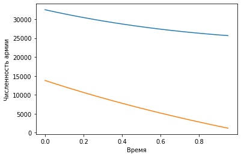

---
## Front matter
lang: ru-RU
title: "Отчет по лабораторной работе 3"
author: |
	Vasilisa Mikhajlovna Kryuchkova\inst{1}
institute: |
	\inst{1}RUDN University, Moscow, Russian Federation
date: 13 February, 2021 Moscow, Russian Federation

## Formatting
toc: false
slide_level: 2
theme: metropolis
header-includes: 
 - \metroset{progressbar=frametitle,sectionpage=progressbar,numbering=fraction}
 - '\makeatletter'
 - '\beamer@ignorenonframefalse'
 - '\makeatother'
aspectratio: 43
section-titles: true
---

# **Прагматика выполнения лабораторной работы**

## Зачем?

Математика -- царица наук!

Каждый, занимающийся математическим моделированием, должен уметь:

* Использовать математический аппарат для решения задач
* Моделировать задачи

# **Цель выполнения лабораторной работы**

## Цель

Построить упрощенную модель боевых действий с помощью Python.

# **Задачи выполнения лабораторной работы**

## Вариант 41

Между страной $Х$ и страной $У$ идет война. Численности состава войск исчисляются от начала войны 
и являются временными функциями $x(t)$ и $y(t)$. В начальный момент времени страна $Х$ имеет армию 
численностью 32 500 человек, а в распоряжении страны $У$ армия численностью в 13 800 человек. Для 
упрощения модели считаем, что коэффициенты $a, b, c, h$ постоянны. Также считаем $P(t)$ и $Q(t)$
непрерывными функциями.

## Задание

Постройте графики изменения численности войск армии $Х$ и армии $У$ для следующих случаев:

1. Модель боевых действий между регулярными войсками
$$\frac{\partial x}{\partial t} = -0,12x(t)-0,54y(t)+|\sin (t+1)|$$
$$\frac{\partial y}{\partial t} = -0,4x(t)-0,27y(t)+|\cos (t+2)|$$

2. Модель ведение боевых действий с участием регулярных войск и партизанских отрядов
$$\frac{\partial x}{\partial t} = -0,26x(t)-0,8y(t)+|\sin (2t)|$$
$$\frac{\partial y}{\partial t} = -0,62x(t)y(t)-0,13y(t)+|\cos (t)|$$

# **Результаты выполнения лабораторной работы**

## График изменения численности армий в боевых действиях между регулярными войсками

{ #fig:001 width=70% } 

## График изменения численности армий в боевых действиях с участием регулярных войск и партизанских отрядов

{ #fig:002 width=70% }

## Выводы

Построила упрощенную модель боевых действий с помощью Python.

В боевых действиях между регулярными войсками победит армия X, причем ей на это потребуется довольно 
много времени (видим по графику, что численность армии Y будет на исходе практический в предельный 
момент времени).

В боевых действиях с участием регулярных войск и партизанских отрядов также победит армия Х, но уже
намного быстрее, чем в 1-ом случае (видим по графику, что армия Y потеряла всех бойцов практически
сразу после начала войны).

## {.standout}

Спасибо за внимание!
