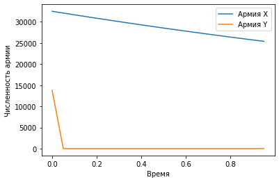

---
# Front matter
lang: ru-RU
title: "Отчёт по лабораторной работе 3"
subtitle: "дисциплина: Математическое моделирование"
author: "Василиса Михайловна Крючкова, НПИбд-02-18"

# Formatting
toc-title: "Содержание"
toc: true # Table of contents
toc_depth: 2
lof: true # List of figures
lot: true # List of tables
fontsize: 12pt
linestretch: 1.5
papersize: a4paper
documentclass: scrreprt
polyglossia-lang: russian
polyglossia-otherlangs: english
mainfont: PT Serif
romanfont: PT Serif
sansfont: PT Sans
monofont: PT Mono
mainfontoptions: Ligatures=TeX
romanfontoptions: Ligatures=TeX
sansfontoptions: Ligatures=TeX,Scale=MatchLowercase
monofontoptions: Scale=MatchLowercase
indent: true
pdf-engine: lualatex
header-includes:
  - \linepenalty=10 # the penalty added to the badness of each line within a paragraph (no associated penalty node) Increasing the value makes tex try to have fewer lines in the paragraph.
  - \interlinepenalty=0 # value of the penalty (node) added after each line of a paragraph.
  - \hyphenpenalty=50 # the penalty for line breaking at an automatically inserted hyphen
  - \exhyphenpenalty=50 # the penalty for line breaking at an explicit hyphen
  - \binoppenalty=700 # the penalty for breaking a line at a binary operator
  - \relpenalty=500 # the penalty for breaking a line at a relation
  - \clubpenalty=150 # extra penalty for breaking after first line of a paragraph
  - \widowpenalty=150 # extra penalty for breaking before last line of a paragraph
  - \displaywidowpenalty=50 # extra penalty for breaking before last line before a display math
  - \brokenpenalty=100 # extra penalty for page breaking after a hyphenated line
  - \predisplaypenalty=10000 # penalty for breaking before a display
  - \postdisplaypenalty=0 # penalty for breaking after a display
  - \floatingpenalty = 20000 # penalty for splitting an insertion (can only be split footnote in standard LaTeX)
  - \raggedbottom # or \flushbottom
  - \usepackage{float} # keep figures where there are in the text
  - \floatplacement{figure}{H} # keep figures where there are in the text
---

# Цель работы

Построить упрощенную модель боевых действий с помощью Python.

# Задание

**Вариант 41**
Между страной $Х$ и страной $У$ идет война. Численности состава войск исчисляются от начала войны 
и являются временными функциями $x(t)$ и $y(t)$. В начальный момент времени страна $Х$ имеет армию 
численностью 32 500 человек, а в распоряжении страны $У$ армия численностью в 13 800 человек. Для 
упрощения модели считаем, что коэффициенты $a, b, c, h$ постоянны. Также считаем $P(t)$ и $Q(t)$
непрерывными функциями.

Постройте графики изменения численности войск армии $Х$ и армии $У$ для следующих случаев:

1. Модель боевых действий между регулярными войсками
$$\frac{\partial x}{\partial t} = -0,12x(t)-0,54y(t)+|\sin (t+1)|$$
$$\frac{\partial y}{\partial t} = -0,4x(t)-0,27y(t)+|\cos (t+2)|$$

2. Модель ведение боевых действий с участием регулярных войск и партизанских отрядов
$$\frac{\partial x}{\partial t} = -0,26x(t)-0,8y(t)+|\sin (2t)|$$
$$\frac{\partial y}{\partial t} = -0,62x(t)y(t)-0,13y(t)+|\cos (t)|$$

# Выполнение лабораторной работы

**1. Боевые действия между регулярными войсками**

1.1. Изучила начальные условия. Коэффициент смертности, не связанный с боевыми действиями, у первой
армии 0,12, а у второй -- 0,27. Коэффициент эффективности первой и второй армии 0,4 и 
0,54 соответственно.  Функция, описывающая подход подкрепление первой армии, $P(t) = |\sin (t+1)|$, 
подкрепление второй армии описывается функцией $Q(t) = |\cos (t+2)|$. $x_{0} = 32500$ -- численность
1-ой армии, $y_{0} = 13800$ -- численность 2-ой армии.

1.2. Оформила начальные условия в код на Python:
```
x0 = 32500
y0 = 13800

a1 = 0.12
b1 = 0.54
c1 = 0.4
h1 = 0.27

def P1(t):
    p1 = np.fabs(np.sin(t + 1))
    return p1
def Q1(t):
    q1 = np.fabs(np.cos(t + 2))
    return q1
```

1.3. Для времени задала следующие условия: $t_{0} = 0$ -- начальный момент времени, $t_{max} = 1$ --
предельный момент времени, $dt = 0,05$ -- шаг изменения времени.

1.4. Добавила в программу условия, описывающие время:
```
t0 = 0
tmax = 1
dt = 0.05
t = np.arange(t0, tmax, dt)
```

1.5. Запрограммировала заданную систему дифференциальных уравнений, описывающих изменение численности
армий:
```
def S1(f, t):
    s11 = -a1*f[0] - b1*f[1] + P1(t)
    s12 = -c1*f[0] - h1*f[1] + Q1(t)
    return s11, s12
```

1.6. Создала вектор начальной численности армий:
```
v = np.array([x0, y0])
```

1.7. Запрограммировала решение системы уравнений:
```
f1 = odeint(S1, v, t)
```

1.8. Описала построение графика изменения численности армий:
```
plt.plot(t, f1)
```

**2. Боевые действия с участием регулярных войск и партизанских отрядов**

2.1. Изучила начальные условия. Коэффициент смертности, не связанный с боевыми действиями, у первой
армии 0,26, а у второй -- 0,13. Коэффициент эффективности первой и второй армии 0,62 и 
0,8 соответственно.  Функция, описывающая подход подкрепление первой армии, $P(t) = |\sin (2t)|$, 
подкрепление второй армии описывается функцией $Q(t) = |\cos (t)|$. Изначальная численность армий 
такая же, как и в п. 1.1.

2.2. Дополнила начальные условия в коде на Python:
```
a2 = 0.26
b2 = 0.8
c2 = 0.62
h2 = 0.13

def P2(t):
    p2 = np.fabs(np.sin(2*t))
    return p2
def Q2(t):
    q2 = np.fabs(np.cos(t))
    return q2
```

2.3. Условия для времени оставила такие же, как и в п. 1.3, соответственно, не дублировала их в 
программе.

2.4. Запрограммировала заданную систему дифференциальных уравнений, описывающих изменение численности
армий:
```
def S2(f, t):
    s21 = -a2*f[0] - b2*f[1] + P2(t)
    s22 = -c2*f[0]*f[1] - h2*f[1] + Q2(t)
    return s21, s22
```

2.5. Т. к. начальная численность армий не изменилась, вектор начальных условий тоже не меняла.

2.6. Запрограммировала решение системы уравнений:
```
f2 = odeint(S2, v, t)
```

2.7. Описала построение графика изменения численности армий:
```
plt.plot(t, f2)
```

**3. Сборка программы**

3.1. Собрала код программы воедино и получила следующий код:
```
import math
import numpy as np
from scipy.integrate import odeint
import matplotlib.pyplot as plt

x0 = 32500
y0 = 13800

a1 = 0.12
b1 = 0.54
c1 = 0.4
h1 = 0.27

a2 = 0.26
b2 = 0.8
c2 = 0.62
h2 = 0.13

t0 = 0
tmax = 1
dt = 0.05
t = np.arange(t0, tmax, dt)

def P1(t):
    p1 = np.fabs(np.sin(t + 1))
    return p1
def Q1(t):
    q1 = np.fabs(np.cos(t + 2))
    return q1

def P2(t):
    p2 = np.fabs(np.sin(2*t))
    return p2
def Q2(t):
    q2 = np.fabs(np.cos(t))
    return q2

def S1(f, t):
    s11 = -a1*f[0] - b1*f[1] + P1(t)
    s12 = -c1*f[0] - h1*f[1] + Q1(t)
    return s11, s12

def S2(f, t):
    s21 = -a2*f[0] - b2*f[1] + P2(t)
    s22 = -c2*f[0]*f[1] - h2*f[1] + Q2(t)
    return s21, s22

v = np.array([x0, y0])

f1 = odeint(S1, v, t)
f2 = odeint(S2, v, t)

plt.plot(t, f1)
plt.ylabel('Численность армии')
plt.xlabel('Время')
plt.legend(['Армия X', 'Армия Y'])

plt.plot(t, f2)
plt.ylabel('Численность армии')
plt.xlabel('Время')
plt.legend(['Армия X', 'Армия Y'])
```

3.2. Получила графики изменения численностей армий (см. рис. -@fig:001 и -@fig:002):

{ #fig:001 width=70% }

{ #fig:002 width=70% }

# Выводы

Построила упрощенную модель боевых действий с помощью Python.

В боевых действиях между регулярными войсками победит армия X, причем ей на это потребуется довольно 
много времени (видим по графику, что численность армии Y будет на исходе практический в предельный 
момент времени).

В боевых действиях с участием регулярных войск и партизанских отрядов также победит армия Х, но уже
намного быстрее, чем в 1-ом случае (видим по графику, что армия Y потеряла всех бойцов практически
сразу после начала войны).
