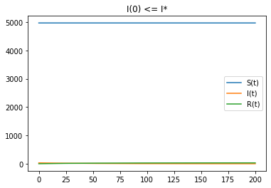
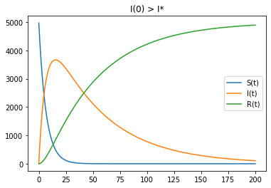

---
## Front matter
lang: ru-RU
title: "Отчет по лабораторной работе 6"
author: |
	Vasilisa Mikhajlovna Kryuchkova\inst{1}
institute: |
	\inst{1}RUDN University, Moscow, Russian Federation
date: 16 March, 2021 Moscow, Russian Federation

## Formatting
toc: false
slide_level: 2
theme: metropolis
header-includes: 
 - \metroset{progressbar=frametitle,sectionpage=progressbar,numbering=fraction}
 - '\makeatletter'
 - '\beamer@ignorenonframefalse'
 - '\makeatother'
aspectratio: 43
section-titles: true
---

# **Прагматика выполнения лабораторной работы**

## Зачем?

Математика -- царица наук!

Каждый, занимающийся математическим моделированием, должен уметь:

* Использовать математический аппарат для решения задач
* Моделировать задачи

# **Цель выполнения лабораторной работы**

## Цель

Построить простейшую модель эпидемии с помощью Python.

# **Задачи выполнения лабораторной работы**

## Задание. Вариант 41

На одном острове вспыхнула эпидемия. Известно, что из всех проживающих на острове ($N = 5000$) в момент начала эпидемии ($t = 0$) число заболевших людей
(являющихся распространителями инфекции) $I(0) = 30$, а число здоровых людей с иммунитетом к болезни $R(0) = 1$. Таким образом, число людей восприимчивых к
болезни, но пока здоровых, в начальный момент времени $S(0) = N - I(0) - R(0)$.

Постройте графики изменения числа особей в каждой из трех групп.
Рассмотрите, как будет протекать эпидемия в случае:

1) если $I(0) \leq I^*$

2) если $I(0) > I^*$

# **Результаты выполнения лабораторной работы**

## Динамика изменения числа людей в каждой из трех групп при $I(0) \leq I^*$

{ #fig:001 width=70% } 

## Динамика изменения числа людей в каждой из трех групп при $I(0) > I^*$

{ #fig:002 width=70% }

## Выводы

Построила простейшую модель эпидемии с помощью Python.

В обоих случаях люди острова смогут победить болезнь.

## {.standout}

Спасибо за внимание!
