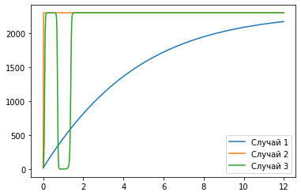
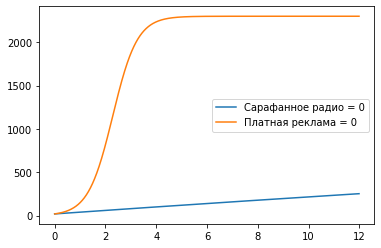

---
## Front matter
lang: ru-RU
title: "Отчет по лабораторной работе 7"
author: |
	Vasilisa Mikhajlovna Kryuchkova\inst{1}
institute: |
	\inst{1}RUDN University, Moscow, Russian Federation
date: 24 March, 2021 Moscow, Russian Federation

## Formatting
toc: false
slide_level: 2
theme: metropolis
header-includes: 
 - \metroset{progressbar=frametitle,sectionpage=progressbar,numbering=fraction}
 - '\makeatletter'
 - '\beamer@ignorenonframefalse'
 - '\makeatother'
aspectratio: 43
section-titles: true
---

# **Прагматика выполнения лабораторной работы**

## Зачем?

Математика -- царица наук!

Каждый, занимающийся математическим моделированием, должен уметь:

* Использовать математический аппарат для решения задач
* Моделировать задачи

# **Цель выполнения лабораторной работы**

## Цель

Построить модель рекламной кампании с помощью Python.

# **Задачи выполнения лабораторной работы**

## Вариант 41

Постройте график распространения рекламы, математическая модель которой описывается следующим уравнением:

- $\frac{\partial n}{\partial t} = (0.205 + 0.000023n(t))(N - n(t))$
- $\frac{\partial n}{\partial t} = (0.0000305 + 0.24n(t))(N - n(t))$
- $\frac{\partial n}{\partial t} = (0.05sin(t) + 0.03cos(4t)n(t))(N - n(t))$

При этом объем аудитории $N$ = 2300, в начальный момент о товаре знает 20 человек. Для случая 2 определите в какой момент времени скорость распространения 
рекламы будет иметь максимальное значение.

## Задания

1. Построить график распространения рекламы о салоне красоты.
2. Сравнить эффективность рекламной кампании при $\alpha_1(t) > \alpha_2(t)$ и $\alpha_1(t) < \alpha_2(t)$.
3. Определить в какой момент времени эффективность рекламы будет иметь максимально быстрый рост.
4. Построить решение, если учитывать вклад только платной рекламы.
5. Построить решение, если предположить, что информация о товаре распространятся только путем «сарафанного радио», сравнить оба решения.

# **Результаты выполнения лабораторной работы**

## Графики распространения рекламы для 1, 2 и 3 случаев

{ #fig:001 width=70% } 

## Графики распространения рекламы для 4 и 5 заданий

{ #fig:002 width=70% }

## Выводы

Построила модель рекламной кампании с помощью Python.

Выяснила, что рекламная кампания для случая, когда $\alpha_1(t) < \alpha_2(t)$ (2 случай), эффективнее, чем кампания для случая, когда 
$\alpha_1(t) > \alpha_2(t)$ (1 случай).

Определила, что в момент времени $t = 0,01$ эффективность рекламы будет иметь максимально быстрый рост.

Выяснила, что реклама только путем "сарафанного радио" эффективнее только платной рекламы.

## {.standout}

Спасибо за внимание!
